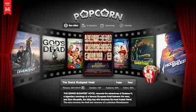

# Popcorn Readme

[Live Demo](http://montagejs.org/apps/popcorn/)

Thank your for exploring our Popcorn demo application.

Popcorn is a movie discovery applicaton optimized for mobile devices. It uses the Rotten Tomatoes RESTful
web service to expose data on new and upcoming theatrical releases and rentals. Users can scroll through
a list of movies, filter by categories (such as top box office or upcoming releases), read details on
selected movies, and watch YouTube trailers inside the application.

## Project Structure

The contents of the Popcorn sample application are structured into the following directories and files:

* assets/ — Contains global styles and images for the application.
* core/ — Contains modules with the data and business logic of the application.
* node_modules/ — Contains the dependencies that power the application in development.
* ui/ — Contains the user interface components of the demo application.
* index.html — Is the entry-point HTML document for the application.
* LICENSE.md — Contains copyright information.
* package.json — Describes your app and its dependencies.
* README.md — Provides information about the demo application and how to install it.

## The User Interface

The Popcorn user interface consists of multiple components. These components are stored in the ui directory
and identified with a .reel extension. Conceptually, the application breaks down into a container that holds
a navigation area and a content area.

* The container is presented by the Main component (main.reel), which accesses the Rotten Tomatoes web service
    and uses the other components in the ui directory for the presentation.
* The navigation is presented by the Categories component (categories.reel) and its Button child component 
    (category-button.reel).
* The content area is represented by the Moviestrip component (moviestrip.reel) — including its Image (image.reel)
    and Overlay (overlay.reel) child components — the Details component (details.reel), and the Player component
    (palyer.reel), which loads the YouTube player when users click the Trailer button in a movie's details view.

Note that MontageJS applications are modular, that is, they are assembled out of encapsulated, resuable
components; regardless of where a component is used, the same HTML, CSS, and JavaScript will control how
that particular component is structured, looks, and behaves. When you expand a component's .reel directory,
you will find inside:

* An HTML file (AKA template in MontageJS speak), which controls the component's structure.
* A JavaScript file, which controls the business logic.
* A CSS file, which controls the component's appearance.
* (Optional) Image files that are unique to the component and are stored with the component for easy reusability.

Note also that MontageJS uses a declarative programming paradigm and a clean separation of concerns:
The declaration is included inside a template's script element, and the HTML is free of any templating language
and business logic, which is a boon to team work between designers and developers.

## The Data

Popcorn uses the Rotten Tomatoes and YouTube RESTful services to expose data on theatrical and rental movie
releases, and to play trailers within the application. The modules that handle the flow of data within the
application are stored in the Core directory. Reactive bindings are used in the respective templates to thread
data from one component to another.

## Preview and Explore

You can preview this application from within [Montage Studio](https://work.montagestudio.com), as a hosted repo,
or locally.

### Hosted, with Montage Studio
To preview the application in Montage Studio, click the Run button at the top of the project explorer.

### Locally, without Montage Studio

To run the demo locally, you need:

* A web server of your choice. MontageJS applications are client-side applications with no particular back-end dependency.
* Cloned GitHub repo of this demo.

To run the Popcorn demo locally, follow these steps:

1. Clone the popcorn [GitHub repo](https://github.com/montagejs/popcorn) in your desktop.

2. Spin up your preferred HTTP server and point your browser to the associated port to serve the popcorn directory.

    >**Note:** During development MontageJS applications rely on XHR to load their various components and modules,
    which is why you will need a web server to serve the demo.

    > If you happen to have [minit](https://github.com/montagejs/minit), the Montage Initializer, installed 
    (`npm install minit -g`) you can run `minit serve` from within the demo directory to set up a server on demand.

# Next Steps

To learn more about Montage Studio and the MontageJS framework, see the following resources:

* [Montage Studio overview](http://docs.montagestudio.com/montage-studio/ide-at-a-glance.html)
* [MontageJS framework](http://docs.montagestudio.com/montagejs/index.html)

## Contact Us

Got questions? Join us on [irc.freenode.net#montage](http://webchat.freenode.net/?channels=montage) or follow us on [Twitter](https://twitter.com/montagejs).

Got feedback or want to report a bug? Let us know by creating a new [GitHub issue](https://github.com/montagejs/popcorn).

## Credit

This demo application was created by the [MontageJS team](http://montagejs.org).

Last updated: May 9, 2014
